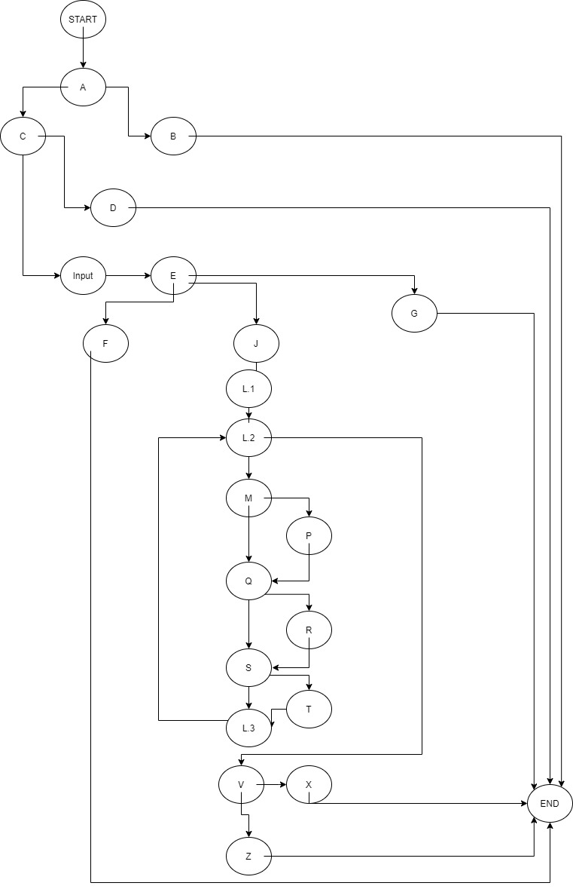
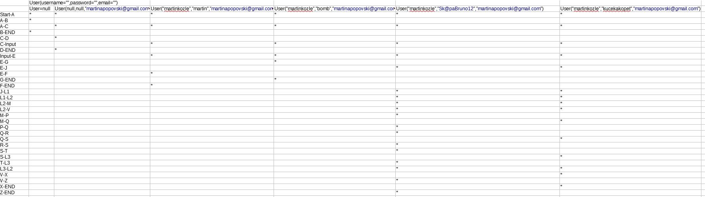
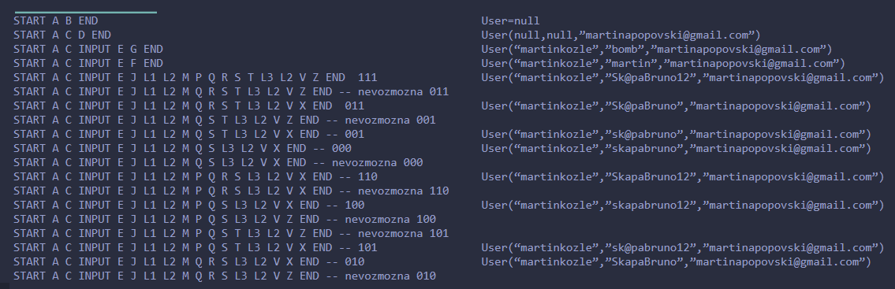

<h1>Втора лабораториска задача по Софтверско инженерство</h1>
<h2>Томислав Игњатов, бр. на индекс 186103</h2>

<b>Група на код:</b>

Ја добив група на код 3

<h3>Control Flow Graph</h3>

<h3>Цикломатска комплексност</h3>
Цикломатската комплексност на овој код е 11 и го добив според формулата бројот на ребра - бројот на темиња + 2 односно 32-23+2=11

<h3>Тест случаи според критерумот Every Branch</h3>

<h3>Тест случаи според критериумот Every Path</h3>

